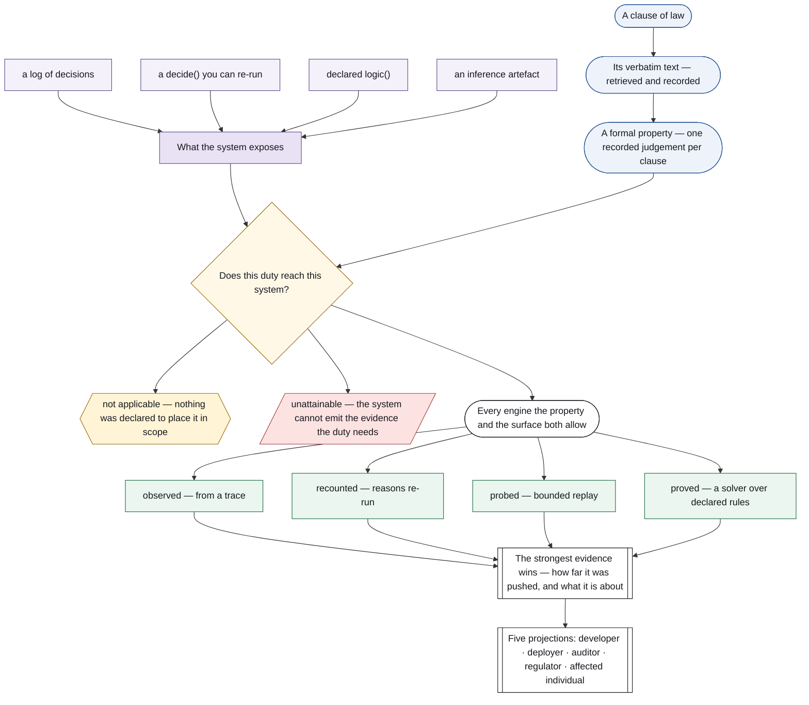
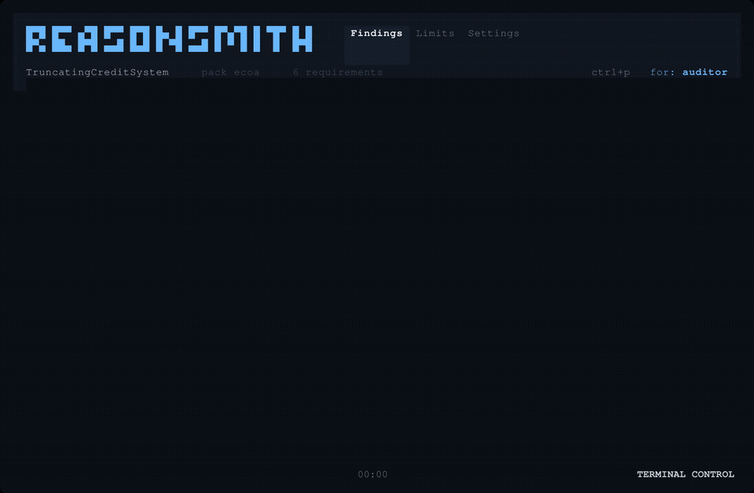

<h1> reasonsmith — evidence records and reason-deletion certificates for decision systems</h1>

[](https://github.com/eduardstan/reasonsmith/actions/workflows/ci.yml)
[](https://github.com/eduardstan/reasonsmith/actions/workflows/ci.yml)
[](https://www.python.org/)
[](https://github.com/eduardstan/reasonsmith/blob/main/LICENSE)

**reasonsmith asks one honest question:** given a system and a regulatory context, what can this system establish, what can its evidence only witness, and what must the report refuse to pretend it knows?

The answer is the minimal audit artefact each stakeholder needs, mechanically derived from that system and bounded by its evidence. Developers use it to check conformance against the evidence surface their system exposes. Regulators read a report with its evidence strength and limits in view. Researchers can follow nine numbered theory chapters where the mathematics is stated once, in one notation, with a machine-checked symbol table and citation registry.


On decision `APP-1042`, the system stated one reason while its inference used five. reasonsmith re-ran that inference, switched reasons off, and measured the four the answer did not depend on. The figure is generated from the run, not typed beside it; regenerate all showcase artefacts with [`docs/build_showcase.py`](docs/build_showcase.py).

> **Demonstration only:** This is a demonstration on frozen synthetic data — not evidence about any real decision.


## The organising question

Start with a clause of law and the evidence your system actually exposes. reasonsmith records the clause as a formal property and asks which evidence rung that property and surface can support. This is not a pipeline: applicability comes first, evidence then branches, and each finding can be read five ways.



The evidence-strength chain is explicit: unattainable, observed trace, recounted reasons, bounded probe, and proof over declared rules. The strongest rung the property and surface both permit wins; an auditor cannot choose it. **Unattainable** means the system cannot emit the evidence the duty needs. **Not applicable** means the system has not declared the regulatory class or decision domain to which the duty is limited. They are different answers, not interchangeable failures.

This tree ships **five packs**, **seven engines**, and **twenty-nine shipped requirements**. The machine-readable source and every destination are listed in [`docs/README.md`](docs/README.md).

## Five reading paths

Choose the question you are carrying into the report. Each invitation gets you to the right operational document first, then points into the mathematical spine:

- **Developer:** Start with [`docs/adopting.md`](docs/adopting.md), follow the theory spine from [`docs/README.md`](docs/README.md), and finish at [`docs/authoring-engines.md`](docs/authoring-engines.md).
- **Deployer:** Compare the three system surfaces in [`docs/three-systems.md`](docs/three-systems.md), use [`docs/adopting.md`](docs/adopting.md), and finish at [`docs/what-this-does-not-do.md`](docs/what-this-does-not-do.md).
- **Auditor:** Start with the generated [`docs/example-output.md`](docs/example-output.md), read [`docs/semantics.md`](docs/semantics.md), and finish with [`docs/findings-nesyarena.md`](docs/findings-nesyarena.md).
- **Regulator:** Start with the statutory retrieval record in [`docs/legal-sources.md`](docs/legal-sources.md), follow [`docs/refinement.md`](docs/refinement.md), and finish with [`docs/findings-nesyarena.md`](docs/findings-nesyarena.md).
- **Affected individual:** Start with [`docs/example-output.md`](docs/example-output.md), read the [`affected-individual audience gallery`](docs/audiences.html) and the audience projection in [`docs/semantics.md`](docs/semantics.md), and finish at [`docs/what-this-does-not-do.md`](docs/what-this-does-not-do.md). The legal reading and formalisation are human assumptions: reasonsmith checks the formal test it is given but does not validate that the test is the correct legal interpretation or whether it applies to your case.

## Install and run

Install from PyPI:

```sh
pip install reasonsmith
```



*The terminal interface is not part of the Python distribution and requires Bun.* [Watch the recording](artifacts/tui/tui-check/demo.mp4) · [View the layout report](docs/tui/layout-report.png)

`--system-module` **imports and executes** the module it names, so point it only at code you trust; `--system` reads a decision log and runs nothing.

For CI, add `--strict-unresolved` to fail on any `not applicable`, `not evaluated`, or `unattainable` row (exit 3); the headline names which unresolved outcomes caused the failure. Without strict mode, exit 0 means **nothing proved wrong**, not **everything was answered**. For example: `reasonsmith check --system "$DECISIONS" --pack ecoa --system-domain consumer-credit --strict-unresolved --json > report.json`.

### CI integrations

The same check can run as a reusable composite Action (the repository-root `action.yml`) and
upload its JSON/HTML reports; the Action defaults to the strict policy described above:

```yaml
- uses: eduardstan/reasonsmith@<ref>
  with:
    system-module: reasonsmith.examples.symbolic_rules:system_under_test
    packs: ecoa
    report-artifact-path: reasonsmith-reports
```

For a container job, see [`Dockerfile`](Dockerfile); build it from this repository and extract the
reports through a mounted directory:

```sh
docker build -t reasonsmith .
mkdir -p reports
docker run --rm -v "$PWD/reports:/reports" reasonsmith check \
  --system-module reasonsmith.examples.symbolic_rules:system_under_test --pack ecoa \
  --json --html /reports/ecoa.html > reports/ecoa.json
```

The image intentionally contains no verifier extras. Extend it in a derived image when a workflow
needs an external verifier such as BLACK for `validate-pack --analyse`.

For a committed, runnable conformance example, this command's stdout is pinned below and regenerated by `python docs/build_readme_transcripts.py`:

```sh
reasonsmith check --system-module reasonsmith.demo:deployed_credit_system --pack ecoa --system-name TruncatingCreditSystem --audience regulator
```

```text
CONFORMANCE REPORT
system: TruncatingCreditSystem
declared scope: undeclared
declared domains: consumer-credit
pack: ecoa
headline: 6 requirements · 6 binding: 3 observed, 1 violated, 1 not evaluated, 1 unattainable · all positives observed-only

REQUIREMENT FINDINGS:
  [OBSERVED] ecoa_reg_b_1002_9_a_1_timing_of_notice (ECOA / Regulation B (12 CFR 1002.9) 12 CFR 1002.9(a)(1)): satisfied
    domain limit: consumer-credit
    summary: Observed over 2 decision(s): temporal monitor for 'always(present(artifact_logs_decision_record) -> ((artifact_logs_notification_latency_days <= 30) or ((artifact_logs_counteroffer_not_accepted >= 0.5) and (artifact_logs_notification_latency_days <= 90))))' satisfied at every decision step.
    Scope of this positive result: this formal property was satisfied only on the supplied 2 decision records at the observed evidence rung; this run did not establish that the trace is complete, representative, or unfiltered, and it did not determine legal adequacy or compliance outside those records.
  [OBSERVED] ecoa_reg_b_1002_9_a_2_written_statement (ECOA / Regulation B (12 CFR 1002.9) 12 CFR 1002.9(a)(2)): satisfied
    domain limit: consumer-credit
    summary: Observed over 2 decision(s): temporal monitor for 'always(present(artifact_logs_decision_record) and present(provenance_model_version) and (present(artifact_logs_reason_explanation) or present(artifact_logs_right_to_reasons_disclosure)))' satisfied at every decision step.
    Scope of this positive result: this formal property was satisfied only on the supplied 2 decision records at the observed evidence rung; this run did not establish that the trace is complete, representative, or unfiltered, and it did not determine legal adequacy or compliance outside those records.
  [OBSERVED] ecoa_reg_b_1002_9_b_2_specific_reasons (ECOA / Regulation B (12 CFR 1002.9) 12 CFR 1002.9(b)(2)): satisfied
    domain limit: consumer-credit
    summary: Observed over 2 decision(s): state monitor for 'present(artifact_logs_reason_explanation) -> ( present(provenance_model_version) and present(scope_statements_local_vs_global) and not contains(artifact_logs_reason_explanation, "internal standards") and not contains(artifact_logs_reason_explanation, "internal policies") and not contains(artifact_logs_reason_explanation, "failed to achieve a qualifying score"))' satisfied at every decision step.
    Scope of this positive result: this formal property was satisfied only on the supplied 2 decision records at the observed evidence rung; this run did not establish that the trace is complete, representative, or unfiltered, and it did not determine legal adequacy or compliance outside those records.
    Formalized subset only — see explain ecoa_reg_b_1002_9_b_2_specific_reasons rationale.
  [PROBED] ecoa_reg_b_1002_9_b_2_principal_reasons_complete (ECOA / Regulation B (12 CFR 1002.9) 12 CFR 1002.9(b)(2)): violated
    evidence basis: artifact — this duty is measured against the inference artefact behind a decision rather than against what the system decided. No trace holds that artefact and the enumeration is exact only on the one artefact it ran over, so the rungs above unattainable are recounted and probed, and neither observed nor proved is reachable however much the system exposes. Which of the two a verdict reaches is a fact about the artefact and not about the search: probed measures a reason set enumerated from a model encoding, recounted measures one the system recounted about its own inference.
    domain limit: consumer-credit
    summary: Violated on 1 of 2 certified decision(s): the stated reasons are not all the reasons. On decision #1 exact inference found 5 reason(s) and the deletion probe showed the system's answer does not depend on 4 of them — C05 — Insufficient number of credit references provided; C03 — Delinquent past or present credit obligations; C04 — Too many recent inquiries on credit bureau report; C02 — Length of time credit has been established is too short. Attribution: The deleted reasons are exactly the 4 lowest-scoring of the 5, and the engine kept the top 1. This is the signature of top-k proof truncation at k=1: top-k works by discarding proofs, so the dropped reasons are lost by configuration, not by error. The missing probability mass is 0.225799. Measured against the inference artefact the system exposed, not read from its decision log.
    certificate finding: FAIL (decision 1)
    probe budget: 13 input(s) replayed, seed none — the proof enumeration and the deletion probes are deterministic, input space: decisions certified (2 values), decisions whose joint search did not finish (0 values), facts switched off (10 values), joint deletion patterns tried (1 values). Strategy: for each decision the system exposed an inference artefact for, its reasons are enumerated exactly by bounded proof enumeration over the ground program and scored by exact weighted model counting; every fact of a reason that no other reason uses is then switched off alone and the system's own engine re-run on the perturbed interpretation. A reason a single deletion moves the engine on is one its answer depends on. A reason no single deletion moves is then put to a second search, because two reasons jointly necessary and individually removable look exactly like two dropped ones: the subset-minimal *joint* deletions the engine notices are enumerated over the remaining facts, and a reason is counted here only where that enumeration ran to exhaustion and met no fact of it. The probe only ever switches a fact off, never on
  [UNATTAINABLE] ecoa_reg_b_1002_9_c_2_incompleteness_notice_runs_out (ECOA / Regulation B (12 CFR 1002.9) 12 CFR 1002.9(c)(2)): inconclusive
    domain limit: consumer-credit
    summary: Unattainable as built: the system declares no capability to emit artifact_logs_incompleteness_notice_sent, so no amount of testing can discharge this requirement. Determined from declared capabilities alone; the system was not executed.
  [NOT EVALUATED] ecoa_reg_b_1002_4_a_no_disparate_treatment (ECOA / Regulation B (12 CFR 1002.4) 12 CFR 1002.4(a)): inconclusive
    evidence basis: relational — this duty is a property of a pair of executions, and a decision record holds one. No length of decision log observes it, so the rungs it can reach are probed and proved; a system exposing only a log cannot discharge it, and that is a fact about the kind of property and not about how much the system exposed.
    domain limit: consumer-credit
    summary: Not evaluated: the system exposes no decide(), so there is no twin decision to run. A counterfactual is what the system would have decided, and a decision log records only what it did — no trace, however long, establishes one. Limit of this duty: it is invariance under one named variable holding all others fixed, so it is a property of treatment and says nothing about effects. A proxy is invisible to it — a rule set that never reads the protected variable and decides by postcode is satisfied here — and a disparate impact is not a thing it can find. It also reaches exactly one variable: a system answerable on several prohibited bases is answered here about the one this duty names.

LIMITS OF THIS REPORT
  This report is not a compliance guarantee and is not legal advice. It assesses system capability information and trace evidence against formal specifications. Whether these findings discharge legal duties remains a determination this tool does not make and cannot make. A requirement reported without a strength was not evaluated or is not applicable, and no verdict on it should be read from this report. Recital and guidance items inform how statutory duties are interpreted but create no obligation of their own; interpretive requirements are evaluated and reported separately, and are never folded into the binding headline counts. A requirement reported not applicable was excluded on one of two independent gates. Either no regulatory class was declared for the system at all, or the class that was declared is not the one the requirement is limited to; or no decision domain was declared for the system at all, or none of the domains that were declared is one the requirement is about. This tool infers neither the class nor the domain, so an undeclared system is neither placed in scope nor cleared of the duty: read the declared scope and domain lines before reading a not-applicable result. The decision-domain vocabulary is written by the pack author and by no regulation, and a duty declaring no domain reaches every system it is run against.
```

The same run can be projected for the affected individual, or a packaged JSONL trace can be checked without a checkout:
```sh
reasonsmith check --system-module reasonsmith.demo:deployed_credit_system --pack ecoa --system-name TruncatingCreditSystem --audience affected-individual
```

```text
CONFORMANCE REPORT
system: TruncatingCreditSystem
pack: ecoa

WHAT THE SYSTEM RECORDED ABOUT THE 2 DECISIONS IT LOGGED
    the decision it recorded: "adverse action on APP-1043"
    the reason it stated: "C01 — Income insufficient for amount of credit requested"
    the decision it recorded: "adverse action on APP-1042"
    the reason it stated: "C01 — Income insufficient for amount of credit requested"

WHETHER THOSE WERE ALL THE REASONS
    4 further reason(s) the system's own answer depended on were not stated. Measured by re-running its inference, not inferred from its log:
    "C05 — Insufficient number of credit references provided"
    "C03 — Delinquent past or present credit obligations"
    "C04 — Too many recent inquiries on credit bureau report"
    "C02 — Length of time credit has been established is too short"

WHAT THIS REPORT COULD NOT CHECK
    1 duty: the system supplied nothing any check here could read, so it was not checked either way.
    1 duty: no check in this report could settle it, so it was left open rather than answered.

REQUIREMENT FINDINGS:
  ecoa_reg_b_1002_9_a_1_timing_of_notice (ECOA / Regulation B (12 CFR 1002.9) 12 CFR 1002.9(a)(1)): satisfied
  ecoa_reg_b_1002_9_a_2_written_statement (ECOA / Regulation B (12 CFR 1002.9) 12 CFR 1002.9(a)(2)): satisfied
  ecoa_reg_b_1002_9_b_2_specific_reasons (ECOA / Regulation B (12 CFR 1002.9) 12 CFR 1002.9(b)(2)): satisfied
  ecoa_reg_b_1002_9_b_2_principal_reasons_complete (ECOA / Regulation B (12 CFR 1002.9) 12 CFR 1002.9(b)(2)): violated
  ecoa_reg_b_1002_9_c_2_incompleteness_notice_runs_out (ECOA / Regulation B (12 CFR 1002.9) 12 CFR 1002.9(c)(2)): inconclusive
  ecoa_reg_b_1002_4_a_no_disparate_treatment (ECOA / Regulation B (12 CFR 1002.4) 12 CFR 1002.4(a)): inconclusive

LIMITS OF THIS REPORT
  This report is not a compliance guarantee and is not legal advice. It assesses system capability information and trace evidence against formal specifications. Whether these findings discharge legal duties remains a determination this tool does not make and cannot make. A requirement reported without a strength was not evaluated or is not applicable, and no verdict on it should be read from this report. Recital and guidance items inform how statutory duties are interpreted but create no obligation of their own; interpretive requirements are evaluated and reported separately, and are never folded into the binding headline counts. A requirement reported not applicable was excluded on one of two independent gates. Either no regulatory class was declared for the system at all, or the class that was declared is not the one the requirement is limited to; or no decision domain was declared for the system at all, or none of the domains that were declared is one the requirement is about. This tool infers neither the class nor the domain, so an undeclared system is neither placed in scope nor cleared of the duty: read the declared scope and domain lines before reading a not-applicable result. The decision-domain vocabulary is written by the pack author and by no regulation, and a duty declaring no domain reaches every system it is run against.
```

```sh
reasonsmith check --system "$(python -m reasonsmith.examples)/sample_decisions.jsonl" --pack ecoa --system-name CreditScoringPipeline --system-domain consumer-credit
```

```text
CONFORMANCE REPORT
system: CreditScoringPipeline
declared scope: undeclared
declared domains: consumer-credit
pack: ecoa
headline: 6 requirements · 6 binding: 3 observed, 1 not evaluated, 2 unattainable · all positives observed-only

REQUIREMENT FINDINGS:
  [OBSERVED] ecoa_reg_b_1002_9_a_1_timing_of_notice (ECOA / Regulation B (12 CFR 1002.9) 12 CFR 1002.9(a)(1)): satisfied
    requires: artifact_logs_decision_record, artifact_logs_notification_latency_days, artifact_logs_counteroffer_not_accepted
    domain limit: consumer-credit
    summary: Observed over 3 decision(s): temporal monitor for 'always(present(artifact_logs_decision_record) -> ((artifact_logs_notification_latency_days <= 30) or ((artifact_logs_counteroffer_not_accepted >= 0.5) and (artifact_logs_notification_latency_days <= 90))))' satisfied at every decision step.
    Scope of this positive result: this formal property was satisfied only on the supplied 3 decision records at the observed evidence rung; this run did not establish that the trace is complete, representative, or unfiltered, and it did not determine legal adequacy or compliance outside those records.
  [OBSERVED] ecoa_reg_b_1002_9_a_2_written_statement (ECOA / Regulation B (12 CFR 1002.9) 12 CFR 1002.9(a)(2)): satisfied
    requires: artifact_logs_decision_record, provenance_model_version
    domain limit: consumer-credit
    summary: Observed over 3 decision(s): temporal monitor for 'always(present(artifact_logs_decision_record) and present(provenance_model_version) and (present(artifact_logs_reason_explanation) or present(artifact_logs_right_to_reasons_disclosure)))' satisfied at every decision step.
    Scope of this positive result: this formal property was satisfied only on the supplied 3 decision records at the observed evidence rung; this run did not establish that the trace is complete, representative, or unfiltered, and it did not determine legal adequacy or compliance outside those records.
  [OBSERVED] ecoa_reg_b_1002_9_b_2_specific_reasons (ECOA / Regulation B (12 CFR 1002.9) 12 CFR 1002.9(b)(2)): satisfied
    requires: artifact_logs_reason_explanation, provenance_model_version, scope_statements_local_vs_global
    domain limit: consumer-credit
    summary: Observed over 3 decision(s): state monitor for 'present(artifact_logs_reason_explanation) -> ( present(provenance_model_version) and present(scope_statements_local_vs_global) and not contains(artifact_logs_reason_explanation, "internal standards") and not contains(artifact_logs_reason_explanation, "internal policies") and not contains(artifact_logs_reason_explanation, "failed to achieve a qualifying score"))' satisfied at every decision step.
    Scope of this positive result: this formal property was satisfied only on the supplied 3 decision records at the observed evidence rung; this run did not establish that the trace is complete, representative, or unfiltered, and it did not determine legal adequacy or compliance outside those records.
    Formalized subset only — see explain ecoa_reg_b_1002_9_b_2_specific_reasons rationale.
  [UNATTAINABLE] ecoa_reg_b_1002_9_b_2_principal_reasons_complete (ECOA / Regulation B (12 CFR 1002.9) 12 CFR 1002.9(b)(2)): inconclusive
    evidence basis: artifact — this duty is measured against the inference artefact behind a decision rather than against what the system decided. No trace holds that artefact and the enumeration is exact only on the one artefact it ran over, so the rungs above unattainable are recounted and probed, and neither observed nor proved is reachable however much the system exposes. Which of the two a verdict reaches is a fact about the artefact and not about the search: probed measures a reason set enumerated from a model encoding, recounted measures one the system recounted about its own inference.
    requires: artifact_logs_reason_explanation, artifact_logs_deleted_reason_count
    domain limit: consumer-credit
    MISSING SIGNALS: artifact_logs_deleted_reason_count
    summary: Unattainable on the evidence supplied: no record in the supplied decision trace carries a value for artifact_logs_deleted_reason_count, and the system declared no capabilities, so nothing here can discharge this requirement. Read from that trace alone; a longer trace could show the system emitting these signals.
  [UNATTAINABLE] ecoa_reg_b_1002_9_c_2_incompleteness_notice_runs_out (ECOA / Regulation B (12 CFR 1002.9) 12 CFR 1002.9(c)(2)): inconclusive
    requires: artifact_logs_incompleteness_notice_sent
    domain limit: consumer-credit
    MISSING SIGNALS: artifact_logs_incompleteness_notice_sent
    summary: Unattainable on the evidence supplied: no record in the supplied decision trace carries a value for artifact_logs_incompleteness_notice_sent, and the system declared no capabilities, so nothing here can discharge this requirement. Read from that trace alone; a longer trace could show the system emitting these signals.
  [NOT EVALUATED] ecoa_reg_b_1002_4_a_no_disparate_treatment (ECOA / Regulation B (12 CFR 1002.4) 12 CFR 1002.4(a)): inconclusive
    evidence basis: relational — this duty is a property of a pair of executions, and a decision record holds one. No length of decision log observes it, so the rungs it can reach are probed and proved; a system exposing only a log cannot discharge it, and that is a fact about the kind of property and not about how much the system exposed.
    requires: artifact_logs_decision_record, applicant_prohibited_basis
    domain limit: consumer-credit
    summary: Not evaluated: the system exposes no decide(), so there is no twin decision to run. A counterfactual is what the system would have decided, and a decision log records only what it did — no trace, however long, establishes one. Limit of this duty: it is invariance under one named variable holding all others fixed, so it is a property of treatment and says nothing about effects. A proxy is invisible to it — a rule set that never reads the protected variable and decides by postcode is satisfied here — and a disparate impact is not a thing it can find. It also reaches exactly one variable: a system answerable on several prohibited bases is answered here about the one this duty names.

LIMITS OF THIS REPORT
  This report is not a compliance guarantee and is not legal advice. It assesses system capability information and trace evidence against formal specifications. Whether these findings discharge legal duties remains a determination this tool does not make and cannot make. A requirement reported without a strength was not evaluated or is not applicable, and no verdict on it should be read from this report. Recital and guidance items inform how statutory duties are interpreted but create no obligation of their own; interpretive requirements are evaluated and reported separately, and are never folded into the binding headline counts. A requirement reported not applicable was excluded on one of two independent gates. Either no regulatory class was declared for the system at all, or the class that was declared is not the one the requirement is limited to; or no decision domain was declared for the system at all, or none of the domains that were declared is one the requirement is about. This tool infers neither the class nor the domain, so an undeclared system is neither placed in scope nor cleared of the duty: read the declared scope and domain lines before reading a not-applicable result. The decision-domain vocabulary is written by the pack author and by no regulation, and a duty declaring no domain reaches every system it is run against.
```

`check` emits text, JSON, or self-contained HTML; it exits 2 for a violation, 1 for usage/input errors, and 0 otherwise.

## Extending reasonsmith

The entry-point extension machinery is already part of reasonsmith. Generate an installable
out-of-tree package without editing this repository:

```sh
reasonsmith init pack my-regulation-pack
reasonsmith init engine my-engine
```

Each scaffold contains TODOs and the correct `reasonsmith.packs` or `reasonsmith.engines`
wiring. Read [`docs/authoring-packs.md`](docs/authoring-packs.md) or
[`docs/authoring-engines.md`](docs/authoring-engines.md) before publishing it. Consumers can
validate the generated report envelope with the versioned
[`report-v2.schema.json`](docs/schema/report-v2.schema.json); regenerate it with
[`docs/build_report_schema.py`](docs/build_report_schema.py).

## Limits

- This is an evidence checker, not a compliance guarantee or legal advice; whether a finding discharges a legal duty remains outside the tool.
- `unattainable`, `not applicable`, and `not evaluated` are distinct findings, not breaches or weaker satisfied results.
- `observed` speaks only about supplied records; `probed` is bounded replay; `proved` covers the declared logic's admitted inputs. A rung is evidence strength, not a compliance grade or confidence score.
- The system's declarations are trusted inputs. An inference artefact must declare monotonicity; a false declaration is reported not evaluated.
- Group-statistical fairness, proxies, disparate impact, open-textured predicates, and legal interpretation beyond the formalised clause are outside this evidence model.
- The legal reading and formalisation are human assumptions: reasonsmith does not validate that the formal test is the correct legal interpretation or that it applies to your case.
- The certificate measures reason deletion only when the system exposes a suitable inference artefact; a log-only system cannot be upgraded by its adapter.

Read the full boundaries in [`docs/what-this-does-not-do.md`](docs/what-this-does-not-do.md) and the soundness obligations in [`docs/semantics.md`](docs/semantics.md) §3.

The full destination map is [`docs/README.md`](docs/README.md); the live dossier is [reasonsmith.dev/report.html](https://reasonsmith.dev/report.html); empirical measurements are in [`RESULTS.md`](RESULTS.md), the backlog in [`ROADMAP.md`](ROADMAP.md), and contribution rules in [`CONTRIBUTING.md`](CONTRIBUTING.md).

## Licence

MIT. See [`LICENSE`](LICENSE).
