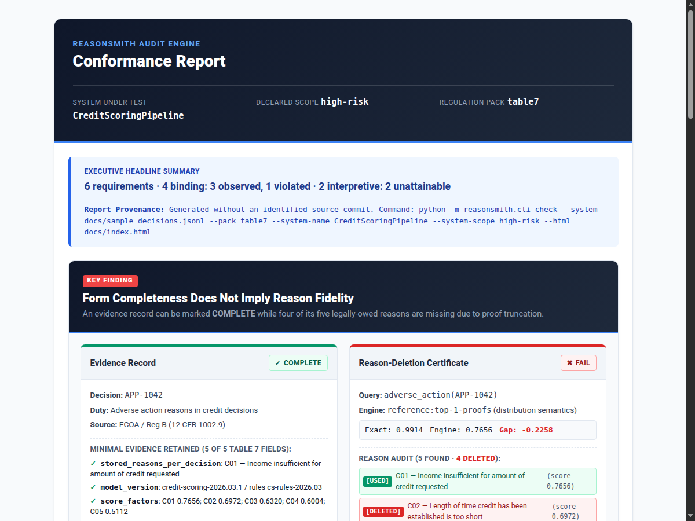

# reasonsmith — audit-grade evidence records and reason-deletion certificates for symbolic decisions

[](https://github.com/eduardstan/reasonsmith/actions/workflows/ci.yml)
[](https://www.python.org/)
[](https://github.com/eduardstan/reasonsmith/blob/main/LICENSE)

[](https://eduardstan.github.io/reasonsmith/)

> [!TIP]
> **Live Interactive Report:** View the self-contained HTML conformance report live on GitHub Pages: [**eduardstan.github.io/reasonsmith**](https://eduardstan.github.io/reasonsmith/).

`reasonsmith` turns legal reason-giving duties into machine-checkable evidence records and reason-deletion certificates. Given a decision, the symbolic artifact behind it, and an applicable regulatory duty, it evaluates structural record completeness and attributes dropped reasons by comparing actual engine behavior against ground-truth exact inference.

## Key Finding: Form Completeness Does Not Imply Reason Fidelity

Evaluating structural form alone can launder severe compliance and reasoning gaps into documents that appear authoritative. In the ECOA/Reg B credit demonstration (`python -m reasonsmith.demo`), `reasonsmith` emits an evidence record that reads **`COMPLETE`** while its paired certificate reads **`FAIL`** because four of its five principal reasons were dropped by proof truncation:

```text
EVIDENCE RECORD [COMPLETE]
decision: APP-1042
duty: Adverse action reasons in credit decisions
legal source: ECOA / Reg B (12 CFR 1002.9)
source of the duty: Table 7 (row 4, p. 36:22), Symbols and Neurons: A Review of Symbolic XAI in Deep Learning, Stan, Sciavicco & Napoletano, Journal of Artificial Intelligence Research, Vol. 86, Article 36, July 2026
symbolic artifact(s) Table 7 asks for: Rule-based “reason codes” mapped to standardized categories; monotone/eligibility constraints for fairness explanations
where it fits: Adverse action notice (AAN) pipeline; compliance reporting

minimal evidence retained:
  [x] stored_reasons_per_decision (Stored reasons per decision):
          C01 — Income insufficient for amount of credit requested
  [x] model_version (model version):
        credit-scoring-2026.03.1 / rules cs-rules-2026.03
  [x] score_factors (score factors):
        C01 0.7656; C02 0.6972; C03 0.6320; C04 0.6004; C05 0.5112
  [x] audit_ids (audit IDs):
        AAN-2026-0731-1042 / trace-9f3c1b
  [x] retention_for_regulatory_lookback (retention for regulatory lookback):
        25 months from notice date, per lender policy

supporting material (NOT Table 7 evidence, and fills no gap above):
  reason-deletion certificate:
    REASON-DELETION CERTIFICATE [FAIL]
    query: adverse_action(APP-1042)
    engine: reference:top-1-proofs   claims: distribution semantics
    exact inference: bounded proof enumeration to depth 1 (nesyarena ground-program IR) + exact weighted model counting
    exact value 0.991399   engine value 0.765600   gap -0.225799   tolerance 1e-09
    reasons: 5 found by exact inference, 1 used by the engine, 4 deleted, 0 not certifiable
```

### Automated Conformance Checking

`reasonsmith` also checks decision logs against formal regulation packs, producing reports whose verdicts carry the strength of the evidence behind them. Run against the committed sample log:

```sh
python -m reasonsmith.cli check --system docs/sample_decisions.jsonl --pack ecoa --system-name CreditScoringPipeline
```

```text
CONFORMANCE REPORT
system: CreditScoringPipeline
declared scope: undeclared
pack: ecoa
headline: 3 requirements · 3 binding: 3 observed

REQUIREMENT FINDINGS:
  [OBSERVED] ecoa_reg_b_1002_9_a_1_timing_of_notice (ECOA / Regulation B (12 CFR 1002.9) 12 CFR 1002.9(a)(1)): satisfied
    requires: artifact_logs_decision_record, artifact_logs_notification_latency_days, artifact_logs_counteroffer_not_accepted
    summary: Observed over 3 decision(s): temporal monitor for 'always((artifact_logs_decision_record >= 0.5) -> ((artifact_logs_notification_latency_days <= 30) or ((artifact_logs_counteroffer_not_accepted >= 0.5) and (artifact_logs_notification_latency_days <= 90))))' satisfied across all time steps.
  [OBSERVED] ecoa_reg_b_1002_9_a_2_written_statement (ECOA / Regulation B (12 CFR 1002.9) 12 CFR 1002.9(a)(2)): satisfied
    requires: artifact_logs_reason_explanation, artifact_logs_decision_record, provenance_model_version
    summary: Observed over 3 decision(s): every required signal (artifact_logs_reason_explanation, artifact_logs_decision_record, provenance_model_version) carries a value in every record. Holds on the trace supplied; nothing here extends the claim to decisions not in it.
  [OBSERVED] ecoa_reg_b_1002_9_b_2_specific_reasons (ECOA / Regulation B (12 CFR 1002.9) 12 CFR 1002.9(b)(2)): satisfied
    requires: artifact_logs_reason_explanation, provenance_model_version, scope_statements_local_vs_global
    summary: Observed over 3 decision(s): every required signal (artifact_logs_reason_explanation, provenance_model_version, scope_statements_local_vs_global) carries a value in every record. Holds on the trace supplied; nothing here extends the claim to decisions not in it.

LIMITS OF THIS REPORT
  This report is not a compliance guarantee and is not legal advice. It assesses system capability information and trace evidence against formal specifications. Whether these findings discharge legal duties remains a determination this tool does not make and cannot make. A requirement reported without a strength was not evaluated or is not applicable, and no verdict on it should be read from this report. Recital and guidance items inform how statutory duties are interpreted but create no obligation of their own; interpretive requirements are evaluated and reported separately, and are never folded into the binding headline counts. A requirement reported not applicable was excluded either because no regulatory class was declared for the system at all, or because the class that was declared is not the one the requirement is limited to. This tool never infers that class, so an undeclared system is neither placed in scope nor cleared of the duty: read the declared scope line before reading a not-applicable result.
```

`observed` is the weakest rung of the strength lattice that can still say a property held: it is read off the trace supplied and claims nothing about decisions outside it. The same log checked against the Table 7 pack still exits 0, because nothing there is a breach: the GDPR Art. 22 and ECOA rows come back observed, the two interpretive rows come back unattainable with their missing signals named, and the two EU AI Act rows come back not applicable against an undeclared regulatory scope — declaring it with `--system-scope high-risk` is what brings them into scope, and that is the run behind the live page above. See [`docs/example-output.md`](docs/example-output.md) for that run and for the full 905-line demo transcript, both stdout pasted unedited.

## Quick Start

Run the full verification suite and demonstration in one block:

```sh
python3 -m venv .venv && source .venv/bin/activate
pip install -e ".[dev]"
ruff check .
pytest
python -m reasonsmith.demo
python -m reasonsmith.cli check --system docs/sample_decisions.jsonl --pack ecoa
```

Every command runs from a fresh clone in that order; `docs/sample_decisions.jsonl` is a committed three-record decision trace, so the last line needs no data of your own. `check` exits 2 when a requirement is violated, 1 on a usage or input error, and 0 otherwise — the `ecoa` run above exits 0.

*Note:* This single installation path is used by CI (`.github/workflows/ci.yml`). Full empirical environment measurements and torch test counts are documented in **[RESULTS.md](RESULTS.md)**.

## Where the Duties Come From

The duty-to-artifact mapping is Table 7 of *Symbols and Neurons: A Review of Symbolic XAI in Deep Learning* (Stan, Sciavicco & Napoletano, JAIR 2026, p. 36:22), reviewing 273 primary studies across five regulatory frameworks: EU AI Act, GDPR, ECOA/Reg B, FDA GMLP, and NIST AI RMF.

Table 7 is transcribed verbatim into `src/reasonsmith/table7.toml`. That file is data, not code: every duty records its row number, and every machine key sits next to the exact cell text it stands for. `traceability_report()` prints the table side by side. Where a design decision and Table 7 disagree, Table 7 wins. Statutory texts are backed by retrieval records in [`docs/legal-sources.md`](docs/legal-sources.md).

## What Is in the Box

### Package Architecture

| File / Module | Description |
|---|---|
| `src/reasonsmith/table7.toml` | The six Table 7 duties transcribed verbatim, with row-level traceability |
| `src/reasonsmith/evidence.py` | Minimal evidence record emitter and missing field reporter |
| `src/reasonsmith/certificate.py` | Reason-deletion certificates against exact inference oracle (`nesyarena`) |
| `src/reasonsmith/conformance.py` | Table 19 checks, including stratified per-group evaluations |
| `src/reasonsmith/demo.py` | End-to-end demonstration (ECOA/Reg B credit and GDPR Art. 22 clinical) |
| `src/reasonsmith/verdict.py` | Core lattice: evidence strength lattice (`unattainable < observed < probed < proved`) and verdict vocabulary |
| `src/reasonsmith/spec.py` | Core requirement loader & specification structures from `packs/*.toml` |
| `src/reasonsmith/sut.py` | System-under-test protocol — declared capability set and decision trace interface |
| `src/reasonsmith/report.py` | Conformance report skeleton, headline builder, static unattainable analysis, and the text/JSON/self-contained-HTML renderers |
| `src/reasonsmith/rulelang.py` | The whitelisted mini-language rule and specification text is parsed and executed in, shared by the rule adapter and the proved engine |
| `src/reasonsmith/adapters/` | SUT protocol adapters for JSONL decision logs, Python callables, and rule-based systems that expose their decision logic |
| `src/reasonsmith/engines/` | Verification engines: `record` completeness check, `observed` rtamt temporal monitor, and `proved` Z3 solver |
| `src/reasonsmith/cli.py` | Command-line interface: `check --system <log.jsonl> --pack <name>` |
| `src/reasonsmith/packs/table7.toml` | Table 7 rows restated as a formal requirement pack |
| `src/reasonsmith/packs/{eu_ai_act,gdpr,ecoa}.toml` | Statutory requirement packs with verbatim quotes from [`docs/legal-sources.md`](docs/legal-sources.md) |

### Core Components

- **The Emitter (`evidence.py`):** `emit(duty_id, decision_id, fields)` returns a record that is either `COMPLETE` or `INCOMPLETE`. An `INCOMPLETE` record explicitly names the fields it lacks. Nothing is defaulted, inferred, or silently dropped. Keys outside the duty's Table 7 row are rejected, and non-Table 7 data is isolated in `attachments`.
- **The Reason-Deletion Certificate (`certificate.py`):** Compares the reasons an engine actually used against exact inference ground truth (enumerated via WMC in `nesyarena`). Using deletion probes, it tests whether disabling isolated facts changes engine output. Two independent checks must pass: the deletion probe (every reason live) and the value check against the exact oracle. Reasons that cannot be probed in isolation are reported as uncertified (`INCONCLUSIVE`).
- **The Conformance Core (`verdict.py`, `report.py`):** A verdict carries the strength of the evidence behind it: `unattainable < observed < probed < proved`. This stage produces all but `probed`. `unattainable` is a set difference over SUT capabilities computed without running the system: a system that cannot emit reasons is reported unattainable on the requirements needing them, with the missing signals named. `observed` evaluates passive decision traces. `probed` needs an engine this build does not have, so a requirement whose formalism no engine covers is reported as not evaluated — no strength and no verdict — rather than judged by a weaker check. Combining zero verdicts is `inconclusive`, never vacuously `satisfied`. Three engines exist: `record` (completeness over a decision trace), `temporal` (rtamt monitors), and `logical` (Z3).
- **The Proved Engine (`engines/proved.py`):** `logical` requirements are discharged by Z3 against the decision logic a system exposes through `sut.logic()` — its variables, its rules, and the constraints its inputs are known to obey. Rules are encoded in static single assignment form, so a rule that reassigns a name means what it means when executed. Three things are refused rather than reported: logic or a property using a construct the encoding does not model, a solver result of `unknown` or a timeout, and premises no input can satisfy — an over-constrained model makes `unsat` prove every property alike, so it counts as no evidence, not as proof. When the solver finds a counterexample, that input is executed before anything is reported: `VIOLATED` at strength `proved` is only claimed once the violation reproduces, and the evidence summary names what it reproduced against, since a system exposing only `logic()` can be replayed only through its declared logic and not through itself.
- **Binding vs interpretive duties and regulatory scope:** Each requirement records whether it is a legally binding duty or an interpretive recital/guidance item, and any regulatory class it is limited to. The headline names both halves — `6 requirements · 4 binding: 2 observed, 2 unattainable · 2 interpretive: 2 observed` — so an interpretive item is reported without being counted as compliance evidence. A class-limited requirement is checked only against a system declared to be in that class via `--system-scope`; the class is never inferred, so an undeclared system has those requirements reported not applicable. Classes come from one fixed vocabulary — `prohibited`, `high-risk`, `limited-risk`, `minimal-risk`, `general-purpose` — which both a pack's `scope` and a declared `--system-scope` are checked against, after trimming whitespace and lowercasing and with nothing else guessed. A value outside it is a usage error naming what would have been accepted, so a misspelling on either side cannot become a duty that quietly never matches. A class the vocabulary knows but the chosen pack does not target is not an error: those duties are reported not applicable as a declared mismatch.
- **The CLI (`cli.py`):** Four packs ship — Table 7, EU AI Act, GDPR, ECOA/Reg B — and `reasonsmith.cli` runs one against a JSONL decision log:

  ```sh
  python -m reasonsmith.cli check --system decisions.jsonl --pack ecoa [--json] [--html report.html]
  python -m reasonsmith.cli check --system decisions.jsonl --pack eu_ai_act --system-scope high-risk --html report.html
  ```

  It exits 2 when a requirement is violated, 1 on a usage or input error, and 0 otherwise. Unattainable, not applicable and not evaluated are findings to read in the report, not breaches, so none of them changes the exit code. Reports render to plain text, structured JSON (`--json`), or a self-contained offline HTML report (`--html FILE`). The CLI takes no capability declaration: it reads capabilities from the supplied log, and a result resting on that says so rather than speaking for the system. To declare them instead, construct `JSONLAdapter(path, declared_capabilities={...})` in Python.
- **Machine-Readable & Visual HTML Output:** Records, certificates, and reports serialize to dicts (`to_dict()`), JSON (`to_json(indent=None)`), and self-contained HTML (`render_html()`). Each carries the same facts as its text rendering, including its missing-field report and its own limits, so a downstream consumer cannot read a partial document as a complete one. Values outside JSON's own types are stringified rather than raising. Conformance results need no serializer: `group_stats()` and `stratified()` already return plain dicts of JSON-native types, so `json.dumps(stratified(groups))` is the whole recipe — and an unmeasured metric serialises as `null`, never `0`. The HTML report opens from any `file://` path with zero network dependencies, presents the evidence strength lattice, splits binding vs interpretive duties, highlights counterexample trace witnesses for violations, and visually distinguishes unattainable architectural gaps from runtime violations.
- **Dependencies & PyPI:** `nesyarena` supplies ground-program IR, proof enumeration, and exact WMC (pinned to `nesyarena==0.1.0` on PyPI in `pyproject.toml`); `pip install -e ".[dev]"` in a venv is the single install path. `rtamt`, which supplies STL temporal monitoring, and `z3-solver`, which supplies the SMT solver behind the proved engine, are declared runtime dependencies of `reasonsmith`, both pinned exactly. `torch`, by contrast, is an optional dependency of `nesyarena` (~1GB) and is deliberately not a declared dependency of `reasonsmith` — it was installed and measured in a separate environment, recorded in [RESULTS.md](RESULTS.md).

### Summary of Empirical Findings

| Metric / Finding | Observed Result | Rationale & Mechanism |
|---|---|---|
| **Stratified Checks (Design A: Confidence Varies)** | Coverage gap: 0.0000<br>Fidelity gap: +0.0535<br>Retained share gap: +0.2802 | Top-k proof truncation keeps fixed proof count regardless of confidence scaling. Coverage remains identical across groups; retained share catches the atypical group's loss of value. |
| **Stratified Checks (Design B: Reason Multiplicity Varies)** | Coverage gap: +0.3000<br>Fidelity gap: +0.1472<br>Retained share gap: +0.1129 | Cases with more reasons suffer lower coverage under fixed k=1 truncation (a case with 5 reasons retains 1/5th; a case with 2 retains 1/2). |
| **Signal Stability (Drift across windows)** | Stability score: 0.3333 | Under top-1 settings, drift in a single signal silently swaps the stated reason across windows on an unchanged applicant file. |

The stratified rows are measured on frozen synthetic cohorts, built to separate the two mechanisms from each other. Whether real atypical cases trip more reasons than typical ones is an empirical question about data this table does not have, and the table does not answer it. Every figure in it is reproduced in **[RESULTS.md](RESULTS.md)**, along with the exact environment and versions, both suites' pass/fail/skip counts with `torch` installed, and a byte-for-byte diff of two demo runs.

Figures this README takes from the paper rather than from running code — the 273 primary studies, the six Table 7 duties — and the rough `~1GB` size of the `torch` download are not measurements and are not reproduced there.

## Limits

**Status: Early research software. Nothing here is a compliance guarantee, and none of it is legal advice.**

- A certificate speaks only about the specific program, base interpretation, and query tested.
- Table 7 completeness checks the **form** of a record, never the truth or accuracy of its contents.
- Static capability analysis (`unattainable`) checks declared or trace-derived signal names, not operational runtime correctness.

## Licence

[MIT](LICENSE)
