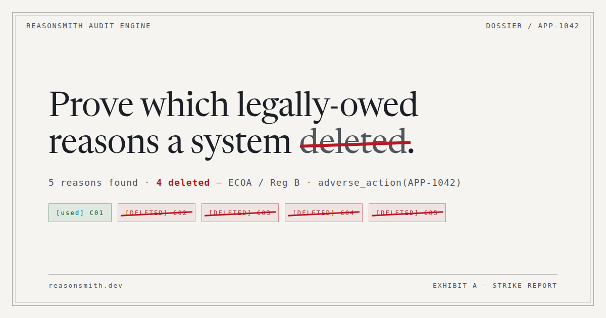

<h1> reasonsmith — evidence records and reason-deletion certificates for decision systems</h1>

[](https://github.com/eduardstan/reasonsmith/actions/workflows/ci.yml)
[](https://www.python.org/)
[](https://github.com/eduardstan/reasonsmith/blob/main/LICENSE)

[](https://reasonsmith.dev/)

> [!TIP]
> **Live on the web:** the landing page is at [**reasonsmith.dev**](https://reasonsmith.dev) — a scroll-driven flight through the proof graph of the demonstration case — and the self-contained conformance dossier at [**reasonsmith.dev/report.html**](https://reasonsmith.dev/report.html). The site lives in its own repo (see [#35](https://github.com/eduardstan/reasonsmith/issues/35)).

[](https://reasonsmith.dev/report.html)

## The state of the art, the gap, and what this adds

**Where compliance tooling stands.** Checking an automated decision system against a regulatory duty is, in practice, checking a document. Model cards, datasheets, audit-log schemas, the EU AI Act's own Article 12 record-keeping duty: each names artefacts the system must produce, and a checker reads what was produced and reports which required fields are filled. That is a real check and it catches real gaps — a missing reason field is a missing reason field.

**The gap.** Existing compliance tools check whether a log has the required fields. None of them states what *strength of evidence* stands behind the verdict. A checker reading a decision log can speak only about the decisions in that log; a checker reasoning over a system's decision rules can speak about every input those rules admit. Both report the same word. The reader of the report cannot tell which one happened, so a claim about three logged decisions and a claim about an unbounded input space arrive indistinguishable — and the weaker of the two is the one that is easy to produce.

**What reasonsmith adds.** Every verdict carries the method that reached it, on a strict lattice — `unattainable < observed < probed < proved` — and a result no engine could establish carries no strength at all rather than a satisfied verdict. Which rung a duty reaches is a fact about the system under test, not about which word a pack author typed: the same property is read off a trace, searched by replay, or proved by a solver depending only on what the system exposes. `RequirementResult` refuses to be constructed claiming more than it has, so the bound travels into every rendering instead of being a convention some renderer might drop. The table in the next section is that claim under test — one duty, three systems, three different rungs — rather than an illustration of it.

**What this does not claim.** A rung is not a compliance grade and not a confidence score: it ranks how a conclusion was reached, never what it was reached about, so a `proved` verdict over logic unrelated to the deployed system is worth less than an `observed` verdict over a year of production decisions, and the lattice cannot see that. Nothing here determines whether a legal duty is discharged. The full statement of what each rung does and does not mean, one engine at a time, is [`docs/semantics.md`](docs/semantics.md).

### The two concrete questions

Given a decision, the symbolic artifact behind it, and an applicable duty, reasonsmith answers:

1. **Is the evidence record complete?** Does it carry every field the duty's formal specification requires?
2. **Did the explanation engine keep the reasons it was supposed to give?** Or did it drop some on the way out?

The first is evaluated against the formal specification and reported with its strength. The second compares actual engine behavior against ground-truth exact inference: where the applicable requirement identifies reasons the statute obliges, its paired reason-deletion certificate shows which of them the engine dropped.

## Any model in: one duty, three systems, three rungs

Neural, probabilistic or symbolic — a system is fed in by writing an adapter that says what it exposes, and what kind of decision it makes. These three, all checked against the *same* binding duty (ECOA / Reg B 12 CFR 1002.9(b)(2), "the statement of reasons ... must be specific"), come back at three different rungs:

| system | what it exposes | rung reached |
|---|---|---|
| [neural risk network](docs/adapters/neural_scorer.py), served behind an inference API | `decisions()` — an exported decision log, nothing else | `observed` |
| [probabilistic log-odds scorer](docs/adapters/probabilistic_scorer.py), in-process | `decisions()` + `decide(case)` replay | `probed`, carrying its search budget |
| [symbolic underwriting rule set](docs/adapters/symbolic_rules.py) | `decisions()` + `logic()` | `proved`, over every input the constraints admit |

All three also declare `system_domains = ("consumer-credit",)`, which is what puts them inside a duty about adverse-action reasons at all: 12 CFR 1002.9 is about consumer-credit decisions, and a system that has declared no decision domain is reported *not applicable* rather than judged. Raising a rung means changing the *system*; declaring a domain it is not in would be a different error entirely.

```sh
for s in neural_scorer probabilistic_scorer symbolic_rules; do python docs/adapters/$s.py; done
```

The CLI reaches the same three systems against a whole pack, no Python needed — `--system-module` **imports the named module, which executes it**, and takes the attribute after the colon as the system under test (the `module:attribute` spelling pytest's `-p` and gunicorn's application path use):

```sh
reasonsmith check --system-module docs.adapters.symbolic_rules:system_under_test --pack ecoa
```

All three verdicts are `satisfied`, and the rung is what separates them: how far each claim reaches — three logged decisions, 200 replayed inputs, or every input the declared constraints admit. The neural system **cannot** reach `probed` or `proved` as built, and no adapter can change that; a test pins that ceiling. Full walkthrough, with the three transcripts and why this duty was chosen over a recital: [`docs/three-systems.md`](docs/three-systems.md).

## What a verdict is worth

Every evaluated result records its evidence strength, on one lattice:

- `unattainable` — on a declared basis, signals the duty needs are outside the system's declared capability set; on a trace basis, no supplied record carries them, which does not establish that the system cannot emit them. Computed without executing the system; the missing signals are named.
- `observed` — read off the decision trace supplied; it claims nothing about decisions outside it.
- `probed` — a bounded search, never a proof: the engine perturbs the decisions the system has already made, replays each generated input through the system itself, reports any counterexample it finds within the budget and otherwise reports that none was found, naming exactly what was searched.
- `proved` — a solver result: the decision logic the system exposes is checked over every input the declared constraints admit, and a counterexample is executed before it is reported as a violation.

Combining zero verdicts is `inconclusive`, never vacuously `satisfied`. A requirement no engine here can evaluate is reported with no strength, rather than judged by a weaker check. What each verdict means — and does not mean — is stated one engine at a time in [`docs/semantics.md`](docs/semantics.md); every soundness claim there names the test that fails if the claim becomes false.

How each shipped requirement got from a clause of law to a formula — and, in a fourth column, what that refinement deliberately did not capture — is recorded in [`docs/refinement.md`](docs/refinement.md), one row per requirement across all four packs.

## Key Finding: Form Completeness Does Not Imply Reason Fidelity

Evaluating structural form alone can launder severe compliance and reasoning gaps into documents that appear authoritative. In the ECOA/Reg B credit demonstration (`python -m reasonsmith.demo`), `reasonsmith` emits an evidence record that reads **`COMPLETE`** while its paired certificate reads **`FAIL`** because four of its five principal reasons were dropped by proof truncation:

```text
EVIDENCE RECORD [COMPLETE]
decision: APP-1042
duty: Adverse action reasons in credit decisions
legal source: ECOA / Reg B (12 CFR 1002.9)
source of the duty: Table 7 (row 4, p. 36:22), Symbols and Neurons: A Review of Symbolic XAI in Deep Learning, Stan, Sciavicco & Napoletano, Journal of Artificial Intelligence Research, Vol. 86, Article 36, July 2026
symbolic artifact(s) Table 7 asks for: Rule-based “reason codes” mapped to standardized categories; monotone/eligibility constraints for fairness explanations
where it fits: Adverse action notice (AAN) pipeline; compliance reporting

minimal evidence retained:
  [x] stored_reasons_per_decision (Stored reasons per decision):
          C01 — Income insufficient for amount of credit requested
  [x] model_version (model version):
        credit-scoring-2026.03.1 / rules cs-rules-2026.03
  [x] score_factors (score factors):
        C01 0.7656; C02 0.6972; C03 0.6320; C04 0.6004; C05 0.5112
  [x] audit_ids (audit IDs):
        AAN-2026-0731-1042 / trace-9f3c1b
  [x] retention_for_regulatory_lookback (retention for regulatory lookback):
        25 months from notice date, per lender policy

supporting material (NOT Table 7 evidence, and fills no gap above):
  reason-deletion certificate:
    REASON-DELETION CERTIFICATE [FAIL]
    query: adverse_action(APP-1042)
    engine: reference:top-1-proofs   claims: distribution semantics
    exact inference: bounded proof enumeration to depth 1 (nesyarena ground-program IR) + exact weighted model counting
    exact value 0.991399   engine value 0.765600   gap -0.225799   tolerance 1e-09
    reasons: 5 found by exact inference, 1 used by the engine, 4 deleted, 0 not certifiable
```

### Automated Conformance Checking

`reasonsmith` also checks decision logs against formal regulation packs, producing reports whose evaluated results record their evidence strength. Run against the committed sample log:

```sh
reasonsmith check --system docs/sample_decisions.jsonl --pack ecoa --system-name CreditScoringPipeline --system-domain consumer-credit
```

```text
CONFORMANCE REPORT
system: CreditScoringPipeline
declared scope: undeclared
declared domains: consumer-credit
pack: ecoa
headline: 3 requirements · 3 binding: 3 observed

REQUIREMENT FINDINGS:
  [OBSERVED] ecoa_reg_b_1002_9_a_1_timing_of_notice (ECOA / Regulation B (12 CFR 1002.9) 12 CFR 1002.9(a)(1)): satisfied
    requires: artifact_logs_decision_record, artifact_logs_notification_latency_days, artifact_logs_counteroffer_not_accepted
    domain limit: consumer-credit
    summary: Observed over 3 decision(s): temporal monitor for 'always(present(artifact_logs_decision_record) -> ((artifact_logs_notification_latency_days <= 30) or ((artifact_logs_counteroffer_not_accepted >= 0.5) and (artifact_logs_notification_latency_days <= 90))))' satisfied across all time steps.
  [OBSERVED] ecoa_reg_b_1002_9_a_2_written_statement (ECOA / Regulation B (12 CFR 1002.9) 12 CFR 1002.9(a)(2)): satisfied
    requires: artifact_logs_decision_record, provenance_model_version
    domain limit: consumer-credit
    summary: Observed over 3 decision(s): temporal monitor for 'always(present(artifact_logs_decision_record) and present(provenance_model_version) and (present(artifact_logs_reason_explanation) or present(artifact_logs_right_to_reasons_disclosure)))' satisfied across all time steps.
  [OBSERVED] ecoa_reg_b_1002_9_b_2_specific_reasons (ECOA / Regulation B (12 CFR 1002.9) 12 CFR 1002.9(b)(2)): satisfied
    requires: artifact_logs_reason_explanation, provenance_model_version, scope_statements_local_vs_global
    domain limit: consumer-credit
    summary: Observed over 3 decision(s): every required signal (artifact_logs_reason_explanation, provenance_model_version, scope_statements_local_vs_global) carries a value in every record. Holds on the trace supplied; nothing here extends the claim to decisions not in it.

LIMITS OF THIS REPORT
  This report is not a compliance guarantee and is not legal advice. It assesses system capability information and trace evidence against formal specifications. Whether these findings discharge legal duties remains a determination this tool does not make and cannot make. A requirement reported without a strength was not evaluated or is not applicable, and no verdict on it should be read from this report. Recital and guidance items inform how statutory duties are interpreted but create no obligation of their own; interpretive requirements are evaluated and reported separately, and are never folded into the binding headline counts. A requirement reported not applicable was excluded on one of two independent gates. Either no regulatory class was declared for the system at all, or the class that was declared is not the one the requirement is limited to; or no decision domain was declared for the system at all, or none of the domains that were declared is one the requirement is about. This tool infers neither the class nor the domain, so an undeclared system is neither placed in scope nor cleared of the duty: read the declared scope and domain lines before reading a not-applicable result. The decision-domain vocabulary is written by the pack author and by no regulation, and a duty declaring no domain reaches every system it is run against.
```

`observed` is the weakest rung of the strength lattice that can still say a property held: it is read off the trace supplied and claims nothing about decisions outside it. `--system-domain consumer-credit` is what puts this log inside 12 CFR 1002.9 at all: those duties are about consumer-credit decisions, and a system that declares no decision domain has them reported not applicable rather than checked. The same log checked against the Table 7 pack still exits 0, because nothing there is a breach: the GDPR Art. 22 and ECOA rows come back observed, the NIST row comes back unattainable with its missing signals named, the FDA GMLP row comes back not applicable because it is about healthcare decisions, and the two EU AI Act rows come back not applicable against an undeclared regulatory scope — declaring it with `--system-scope high-risk` is what brings them into scope, and that is the run behind the dossier at [reasonsmith.dev/report.html](https://reasonsmith.dev/report.html). See [`docs/example-output.md`](docs/example-output.md) for that run and for the full 905-line demo transcript, both stdout pasted unedited.

## Quick Start

1. Install the published package. This puts the `reasonsmith` command on your PATH, with `python -m reasonsmith.cli` staying available:

```sh
pip install reasonsmith
```

2. Run the shipped demonstration:

```sh
python -m reasonsmith.demo
```

The demonstration runs on frozen synthetic data included in the package. It needs no input file or source checkout and prints the complete demonstration, including the `NOT PRODUCED` reasoning and `LIMITS` sections.

3. Audit your own decision log against a regulation pack:

```sh
reasonsmith check --system /path/to/your-decisions.jsonl --pack gdpr --html report.html
```

`check` runs one of the four shipped packs (Table 7, EU AI Act, GDPR, ECOA/Reg B) against your JSONL decision log, printing the report as text, JSON (`--json`), or a self-contained HTML report (`--html FILE`). It exits 2 when a requirement is violated, 1 on a usage or input error, and 0 otherwise.

A decision log exposes neither `decide()` nor `logic()`, so a `--system` run cannot rise above `observed`. To check the system itself, name an adapter instead:

```sh
reasonsmith check --system-module your_package.audit:system_under_test --pack gdpr
```

**`--system-module` imports the named module, which executes it**, and takes the attribute after the colon — a `SystemUnderTest` or a zero-argument factory returning one — as the system under test. The module is searched from the current directory. It refuses `--system` and `--capabilities`, which name a different system and speak for a log's adapter respectively. Three worked examples: [`docs/three-systems.md`](docs/three-systems.md).

Contributors and developers install from source instead, running the full verification suite and demonstration from the checkout:

```sh
git clone https://github.com/eduardstan/reasonsmith.git
cd reasonsmith
python3 -m venv .venv && source .venv/bin/activate
pip install -e ".[dev]"
ruff check .
pytest
python -m reasonsmith.demo
reasonsmith check --system docs/sample_decisions.jsonl --pack ecoa --system-domain consumer-credit
```

Every command in the source block runs from a fresh clone in that order; the `ecoa` run above exits 0.

*Note:* This source install is the one CI itself runs (`.github/workflows/ci.yml`). Full empirical environment measurements and torch test counts are documented in **[RESULTS.md](RESULTS.md)**.

## Where the Duties Come From

The duty-to-artifact mapping is Table 7 of *Symbols and Neurons: A Review of Symbolic XAI in Deep Learning* (Stan, Sciavicco & Napoletano, JAIR 2026, p. 36:22), reviewing 273 primary studies across five regulatory frameworks: EU AI Act, GDPR, ECOA/Reg B, FDA GMLP, and NIST AI RMF.

Table 7 is transcribed verbatim into `src/reasonsmith/table7.toml`. That file is data, not code: every duty records its row number, and every machine key sits next to the exact cell text it stands for. `traceability_report()` prints the table side by side. Where a design decision and Table 7 disagree, Table 7 wins. Statutory texts are backed by retrieval records in [`docs/legal-sources.md`](docs/legal-sources.md).

## What Is in the Box

### Package Architecture

| File / Module | Description |
|---|---|
| `src/reasonsmith/table7.toml` | The six Table 7 duties transcribed verbatim, with row-level traceability |
| `src/reasonsmith/evidence.py` | Minimal evidence record emitter and missing field reporter |
| `src/reasonsmith/certificate.py` | Reason-deletion certificates against exact inference oracle (`nesyarena`) |
| `src/reasonsmith/conformance.py` | Table 19 checks, including stratified per-group evaluations |
| `src/reasonsmith/demo.py` | End-to-end demonstration of all six Table 7 duties (EU AI Act Art. 13 and Art. 12, GDPR Art. 22 clinical, ECOA/Reg B credit, FDA GMLP SaMD, NIST AI RMF continuous monitoring) |
| `src/reasonsmith/verdict.py` | Core lattice: evidence strength lattice (`unattainable < observed < probed < proved`) and verdict vocabulary |
| `src/reasonsmith/spec.py` | Core requirement loader & specification structures from `packs/*.toml` |
| `src/reasonsmith/sut.py` | System-under-test protocol — declared capabilities, decision trace, optional replay hook, and exposed logic |
| `src/reasonsmith/report.py` | Conformance report skeleton, headline builder, static unattainable analysis, and the text/JSON/self-contained-HTML renderers |
| `src/reasonsmith/rulelang.py` | The whitelisted mini-language rule and specification text is parsed and executed in, shared by the rule adapter and the proved engine |
| `src/reasonsmith/adapters/` | SUT protocol adapters for JSONL decision logs, Python callables, and rule-based systems that expose their decision logic |
| `src/reasonsmith/engines/` | Verification engines: `record` completeness check, `observed` rtamt temporal monitor, `probed` perturb-and-replay search, and `proved` Z3 solver |
| `src/reasonsmith/cli.py` | Command-line interface (`reasonsmith` / `python -m reasonsmith.cli`): `check --system /path/to/your-decisions.jsonl --pack gdpr --capabilities /path/to/capabilities.txt` and `validate-pack gdpr` |
| `src/reasonsmith/drift.py` | Statute drift check (`python -m reasonsmith.drift`): re-fetches the official legal sources and re-verifies every pack quote, reporting `match` / `differ` / `could-not-verify` without ever editing a pack |
| `src/reasonsmith/packs/table7.toml` | Table 7 rows restated as a formal requirement pack |
| `src/reasonsmith/packs/{eu_ai_act,gdpr,ecoa}.toml` | Statutory requirement packs with verbatim quotes from [`docs/legal-sources.md`](docs/legal-sources.md) |

### Core Components

- **The Emitter (`evidence.py`):** `emit(duty_id, decision_id, fields)` returns a record that is either `COMPLETE` or `INCOMPLETE`. An `INCOMPLETE` record explicitly names the fields it lacks. Nothing is defaulted, inferred, or silently dropped. Keys outside the duty's Table 7 row are rejected, and non-Table 7 data is isolated in `attachments`.
- **The Reason-Deletion Certificate (`certificate.py`):** Compares the reasons an engine actually used against exact inference ground truth (enumerated via WMC in `nesyarena`). Using deletion probes, it tests whether disabling isolated facts changes engine output. Two independent checks must pass: the deletion probe (every reason live) and the value check against the exact oracle. Reasons that cannot be probed in isolation are reported as uncertified (`INCONCLUSIVE`).
- **The Conformance Core (`verdict.py`, `report.py`):** Every evaluated result records its evidence strength: `unattainable < observed < probed < proved`. `unattainable` is a set difference over SUT capabilities computed without running the system: with declared capabilities it describes the system, while with trace-derived capabilities it describes only the supplied records; either way, the missing signals are named. `observed` evaluates passive decision traces. `probed` actively replays perturbed inputs. `proved` is a solver result. A requirement no engine here can evaluate is reported as not evaluated — no strength and no satisfied-or-violated conclusion — rather than judged by a weaker check. Combining zero verdicts is `inconclusive`, never vacuously `satisfied`. Every requirement's `spec` is a formula in one property language (`rulelang.py`), and `formalism` names which fragment it belongs to: `record` (a conjunction of `present(signal)` atoms), `temporal` (a formula using a temporal operator), `logical` (any other property of one decision record). The fragment says what the property *is*; **what discharges it is a fact about the system**, not about the pack — the same presence property is `observed` against a trace, `probed` against a system exposing `decide()`, and `proved` against one exposing `logic()`. See `docs/semantics.md` §3.5.
- **The Proved Engine (`engines/proved.py`):** `logical` requirements are discharged by Z3 against the decision logic a system exposes through `sut.logic()` — its variables, its rules, and the constraints its inputs are known to obey. Rules are encoded in static single assignment form, so a rule that reassigns a name means what it means when executed. Three things are refused rather than reported: logic or a property using a construct the encoding does not model, a solver result of `unknown` or a timeout, and premises no input can satisfy — an over-constrained model makes `unsat` prove every property alike, so it counts as no evidence, not as proof. When the solver finds a counterexample, that input is executed before anything is reported: `VIOLATED` at strength `proved` is only claimed once the violation reproduces, and the evidence summary names what it reproduced against, since a system exposing only `logic()` can be replayed only through its declared logic and not through itself. The GDPR pack ships the first `logical` requirement proved against real statute: `gdpr_art22_1_no_prohibited_decision_for_any_input` asks Z3 whether the exposed rules admit any input on which a decision is solely automated and significantly affecting while no Article 22(2) basis applies and the Article 22(3) route to human intervention is closed. That duty is universal, so a record check over a supplied trace cannot express it; a `proved` verdict here is a statement about the exposed rules over every input the declared constraints admit, and the pack's description says so in full — it is not a determination that the controller has discharged Article 22.
- **The Probed Engine (`engines/probed.py`):** The rung for a system whose decision logic cannot be inspected. A `logical` requirement against a system that exposes `decide()` but no `logic()` is searched rather than proved: the engine takes the decisions the system has already made, perturbs their fields — over the values the trace shows, the property's own numeric thresholds and their neighbours — and replays each generated input through the system itself. A counterexample is replayed a second time before it is reported, and one that does not reproduce is a defect in the search, so it is reported not evaluated rather than as a violation. No counterexample within the budget is `probed`, never `proved`: the verdict carries what was searched — how many inputs were replayed, the strategy, the seed, and the fields the search could vary — and `RequirementResult` refuses to be constructed without it, so no rendering can drop it. The same seed replays the same inputs in the same order, so a reported budget can be re-derived. Defaults are 200 replayed inputs at seed 0, both configurable.
- **Binding vs interpretive duties, regulatory scope and decision domain:** Each requirement records whether it is a legally binding duty or an interpretive recital/guidance item, any regulatory class it is limited to, and the kinds of decision it is about. The headline names both halves — `6 requirements · 4 binding: 2 observed, 2 unattainable · 2 interpretive: 2 observed` — so an interpretive item is reported without being counted as compliance evidence. A class-limited requirement is checked only against a system declared to be in that class via `--system-scope`; the class is never inferred, so an undeclared system has those requirements reported not applicable. Classes come from one fixed vocabulary — `prohibited`, `high-risk`, `limited-risk`, `minimal-risk`, `general-purpose` — which both a pack's `scope` and a declared `--system-scope` are checked against, after trimming whitespace and lowercasing and with nothing else guessed. A value outside it is a usage error naming what would have been accepted, so a misspelling on either side cannot become a duty that quietly never matches. A class the vocabulary knows but the chosen pack does not target is not an error: those duties are reported not applicable as a declared mismatch. `domains` is a second gate on a different axis, working the same way through `--system-domain` (repeat it for a system that makes more than one kind of decision) and matched by intersection, so one shared domain is enough; a duty declaring no domain reaches every system. One difference matters more than the mechanism: `REGULATORY_CLASSES` is the EU AI Act's own vocabulary, but no statute defines a list of decision domains, so `DECISION_DOMAINS` is written in this repository. A pack limiting a duty to a domain must say so in its description, and a not-applicable verdict on that gate reports a classification a pack author made rather than a finding about a statute's reach ([`docs/authoring-packs.md`](docs/authoring-packs.md), *the decision-domain vocabulary is yours, not the regulation's*).
- **The CLI (`cli.py`):** Four packs ship — Table 7, EU AI Act, GDPR, ECOA/Reg B — and the CLI runs one against a JSONL decision log. It is installed as the `reasonsmith` command (`pip install reasonsmith`) and stays runnable as `python -m reasonsmith.cli`:

  ```sh
  reasonsmith check --system /path/to/your-decisions.jsonl --pack ecoa --system-domain consumer-credit
  reasonsmith check --system /path/to/your-decisions.jsonl --pack eu_ai_act --system-scope high-risk --html report.html
  reasonsmith validate-pack ecoa eu_ai_act gdpr table7
  ```

  `check` exits 2 when a requirement is violated, 1 on a usage or input error, and 0 otherwise. Unattainable, not applicable and not evaluated are findings to read in the report, not breaches, so none of them changes the exit code. Reports render to plain text, structured JSON (`--json`), or a self-contained offline HTML report (`--html FILE`). By default the CLI reads capabilities from the supplied log, and a result resting on that says so rather than speaking for the system; pass `--capabilities /path/to/capabilities.txt` to instead have the system's maintainers declare what it can emit. The file has one signal name per line; blank lines and whole-line comments whose first nonblank character is `#` are ignored. The report then says the capabilities were declared. An empty declaration file declares nothing, which is a distinct claim from having no declaration at all, and a malformed line is refused naming the file and the line. `validate-pack` validates one or more requirement packs and prints what each contains, exiting 0 for any packs a `check` run could load and 1 at the first one the loader refuses, naming the file and the requirement at fault; the authoring guide is [`docs/authoring-packs.md`](docs/authoring-packs.md).
- **Machine-Readable & Visual HTML Output:** Records, certificates, and reports serialize to dicts (`to_dict()`), JSON (`to_json(indent=None)`), and self-contained HTML (`render_html()`). Each carries the same facts as its text rendering, including its missing-field report and its own limits, so a downstream consumer cannot read a partial document as a complete one. Values outside JSON's own types are stringified rather than raising. Conformance results need no serializer: `group_stats()` and `stratified()` already return plain dicts of JSON-native types, so `json.dumps(stratified(groups))` is the whole recipe — and an unmeasured metric serialises as `null`, never `0`. The HTML report opens from any `file://` path with zero network dependencies, presents the evidence strength lattice, splits binding vs interpretive duties, highlights counterexample trace witnesses for violations, and visually distinguishes unattainable architectural gaps from runtime violations.
- **The Statute Drift Check (`drift.py`):** A maintenance check, not a conformance engine. `python -m reasonsmith.drift` re-fetches each official statutory document recorded in [`docs/legal-sources.md`](docs/legal-sources.md) and compares the packs' `verbatim_text` against the live source, collapsing only whitespace (the one thing a printer legitimately changes). Every requirement is `match`, `differ` (both strings named) or `could-not-verify` (the source is unreachable or no longer carries the passage — never a pass), and a pack is never edited automatically. `.github/workflows/statute-drift.yml` runs it on the first of every month and files a single GitHub issue when anything drifts; the tests run the same check against recorded byte-faithful fixture slices, so the suite needs no network.
- **Dependencies & PyPI:** `reasonsmith` 0.2.0 is published on PyPI (`pip install reasonsmith`). `nesyarena` supplies ground-program IR, proof enumeration, and exact WMC (pinned to `nesyarena==0.1.0` on PyPI in `pyproject.toml`); `pip install -e ".[dev]"` in a venv is the contributor install, pulling the dev tooling in with the source checkout. `rtamt`, which supplies STL temporal monitoring, and `z3-solver`, which supplies the SMT solver behind the proved engine, are declared runtime dependencies of `reasonsmith`, both pinned exactly. `torch`, by contrast, is an optional dependency of `nesyarena` (~1GB) and is deliberately not a declared dependency of `reasonsmith` — it was installed and measured in a separate environment, recorded in [RESULTS.md](RESULTS.md).

### Summary of Empirical Findings

| Metric / Finding | Observed Result | Rationale & Mechanism |
|---|---|---|
| **Stratified Checks (Design A: Confidence Varies)** | Coverage gap: 0.0000<br>Fidelity gap: +0.0535<br>Retained share gap: +0.2802 | Top-k proof truncation keeps fixed proof count regardless of confidence scaling. Coverage remains identical across groups; retained share catches the atypical group's loss of value. |
| **Stratified Checks (Design B: Reason Multiplicity Varies)** | Coverage gap: +0.3000<br>Fidelity gap: +0.1472<br>Retained share gap: +0.1129 | Cases with more reasons suffer lower coverage under fixed k=1 truncation (a case with 5 reasons retains 1/5th; a case with 2 retains 1/2). |
| **Signal Stability (Drift across windows)** | Stability score: 0.3333 | Under top-1 settings, drift in a single signal silently swaps the stated reason across windows on an unchanged applicant file. |

The stratified rows are measured on frozen synthetic cohorts, built to separate the two mechanisms from each other. Whether real atypical cases trip more reasons than typical ones is an empirical question about data this table does not have, and the table does not answer it. Every figure in it is reproduced in **[RESULTS.md](RESULTS.md)**, along with the exact environment and versions, both suites' pass/fail/skip counts with `torch` installed, and a byte-for-byte diff of two demo runs.

Figures this README takes from the paper rather than from running code — the 273 primary studies, the six Table 7 duties — and the rough `~1GB` size of the `torch` download are not measurements and are not reproduced there.

## Who could use this, and what is missing first

Four audiences this work is aimed at, and — for each — what is missing before the tool is usable to
them. These are gaps, not wishes: every one is stated in a committed document, cited here. A reader
from one of these groups should be able to recognise their own blocker.

**Insurers** pricing exposure on an automated decision system. Missing: a claim that survives past
the trace. `observed` covers exactly the records supplied and establishes nothing about decisions
outside them, and no engine here reasons over a trace-wide formula, so every duty about behaviour
*over a lifetime* — retention, continuous monitoring — is met today by a check over one supplied run
([`docs/refinement.md`](docs/refinement.md), *the trace is a sample*; `ROADMAP.md` §1). Also missing:
any defence against the insured. The one duty that reads an approximation error reads a number the
system declares about itself, which nothing verifies — it rewards the measurement, not the accuracy,
and a system that under-reports passes ([`docs/findings-nesyarena.md`](docs/findings-nesyarena.md),
finding 1). And no requirement in any shipped pack checks a fairness property (`ROADMAP.md` §3),
which is where a large share of the liability actually sits.

**Regulators** wanting a report to stand as supervisory evidence. Missing: authority over the
vocabulary a duty's reach is written in. A duty now names the decision domains it is about, and a
system that has declared none is reported `not applicable` rather than `satisfied` — the ECOA
adverse-action duty that once cleared a graph-reachability benchmark issuing no credit no longer
reaches it ([`docs/findings-nesyarena.md`](docs/findings-nesyarena.md), finding 3). But the domain
vocabulary is written in this repository and by no regulation, because no statute defines one, so a
not-applicable verdict reports a classification a pack author made rather than a finding about the
statute's reach — and nothing checks that a system declaring `consumer-credit` issues credit
([`docs/authoring-packs.md`](docs/authoring-packs.md), *the decision-domain vocabulary is yours*).
Missing too: authority over the refinement. Which formula stands for a
clause is a judgement made in this repository and recorded as such — the proxy chosen for
*specific* in 12 CFR 1002.9(b)(2) is the pack author's, and the regulation names nothing of the kind
([`docs/refinement.md`](docs/refinement.md)). One shipped property is still known to be wider than
its clause: 12 CFR 1002.9(a)(2) is now formalised as the either/or it is, and either lawful branch
satisfies it, but (b)(2) is triggered only where (a)(2)(i) requires a statement of reasons, and that
trigger is not modelled — so a creditor lawfully using the disclosure alternative is reported
violated on (b)(2). A false positive against a lawful practice disqualifies a tool from supervisory
use until it is fixed.

**Auditors** running this against a client's system. Missing: reach into systems that are only logs.
For any system exposing nothing but a decision trace, `observed` is the ceiling whatever the pack
asks ([`docs/findings-nesyarena.md`](docs/findings-nesyarena.md), finding 2) — and most audited
systems are logs. Missing also: an adversarial default. reasonsmith checks what a system says, not
whether it was honest: a declared capability set, a trace and exposed logic are each taken at their
word, and where exposed logic and the trace disagree the proof is reported and the trace is never
read for that duty ([`docs/semantics.md`](docs/semantics.md) §3, §3.5). And no cryptographic
signature is verified anywhere in this repository — a `signer` field is checked for being non-empty
([`docs/refinement.md`](docs/refinement.md), Table 7 Art. 12 row), so the evidence chain is
unattested.

**Researchers** comparing systems or engines. This is the audience the tool is closest to usable
for: [`docs/findings-nesyarena.md`](docs/findings-nesyarena.md) is a real run against five
`nesyarena` provenances, and `docs/nesyarena-conformance-report.md` is its regenerable evidence.
Missing: properties worth differentiating a system on. Fifteen of the eighteen shipped requirements
are presence checks, against one `logical` and two `temporal` ones, so a battery of engines mostly
agrees by construction. Missing also: independence. The packs are authored here, so a cross-system
comparison measures this repository's refinement as much as it measures the systems — a benchmark
needs a pack set whose fourth column someone other than its author has reviewed
([`docs/refinement.md`](docs/refinement.md)).

## Roadmap

[**`ROADMAP.md`**](ROADMAP.md) is the public backlog: four numbered objectives, each with the gap
it closes, a measurable outcome that fails today, and what it depends on — including the two that
are deliberately blocked and why. It also lists what is deliberately *not* planned, so a proposal
for one of those gets an answer rather than silence.

The repository has [`good first issue`](https://github.com/eduardstan/reasonsmith/labels/good%20first%20issue)
work sized for a first contribution, and the question that most needs outside answers — *which
regulation should the next pack cover?* — is open in
[Discussions](https://github.com/eduardstan/reasonsmith/discussions/54). [`CONTRIBUTING.md`](CONTRIBUTING.md)
has the setup, the verification commands and the standing rules.

## Limits

**Status: Early research software. Nothing here is a compliance guarantee, and none of it is legal advice.**

- A certificate speaks only about the specific program, base interpretation, and query tested.
- Table 7 completeness checks the **form** of a record, never the truth or accuracy of its contents.
- Static capability analysis (`unattainable`) checks declared or trace-derived signal names, not operational runtime correctness.

## Licence

[MIT](LICENSE)
