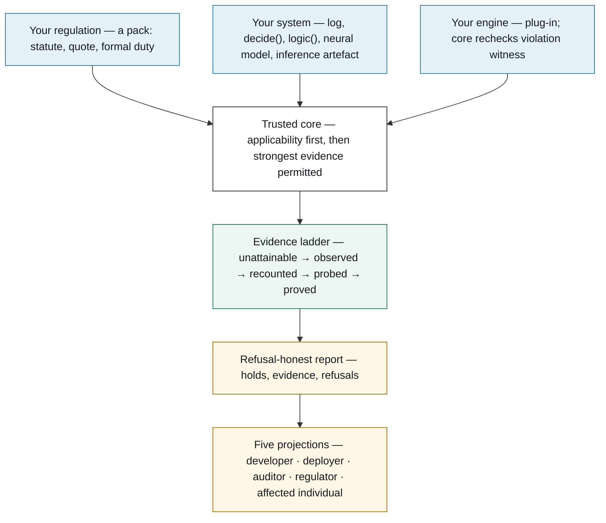
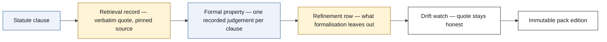
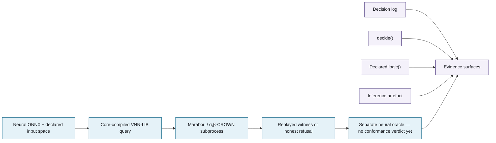
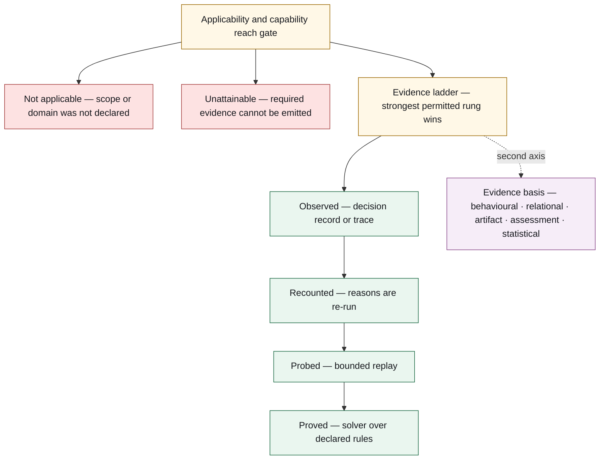
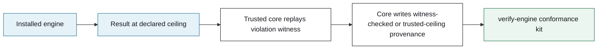
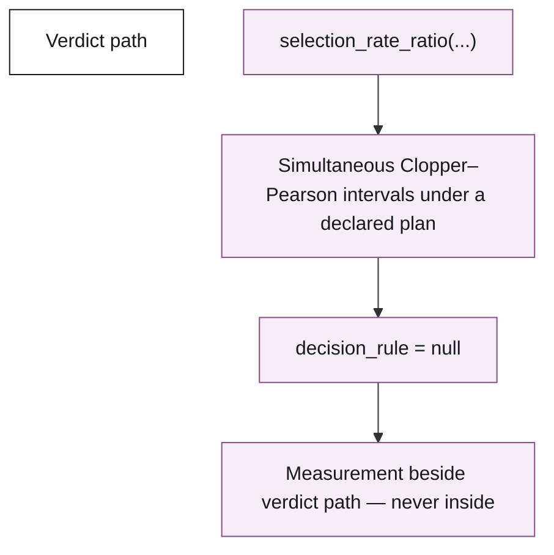
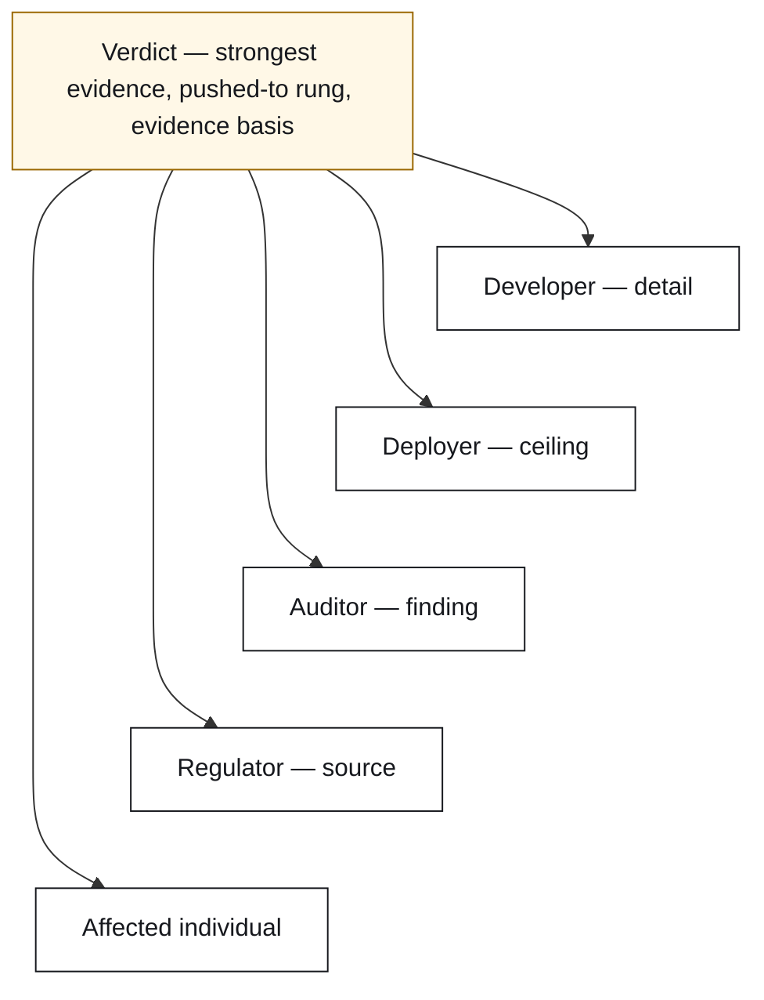

# Reasonsmith architecture

This page is the zoomed view of the [README organising question](../README.md#the-organising-question). The macro is the 30-second orientation; each section then opens one component without changing what a verdict means.

## At a glance

The three blue joints are deliberately open: bring your own regulation, system, and engine. The trusted core checks what they provide, stops at the strongest evidence the property and surface permit, and keeps refusals visible.

## From statute to formal duty

A pack keeps the legal path inspectable: the quote is retrieved and pinned before it becomes a formal property, and a refinement row records what that formalisation does not decide. Editions are immutable rather than silently rewritten. The repository currently carries seven packs and 41 duties. See [pack authoring](authoring-packs.md), the [legal retrieval record](legal-sources.md), and the [refinement record](refinement.md).

## What the system exposes

A subject contributes the surface it actually exposes: a log, replayable decision procedure, declared rules, a neural model with its input space, or an inference artefact. The neural path is a separate oracle: the core compiles the query, a subprocess searches it, and a SAT witness is replayed; an honest refusal is not a conformance verdict. Compare the [three systems](three-systems.md), [neural verifier boundary](neural-verifiers.md), and [language-model adapter](language-model.md).

## Applicability and the evidence ladder

The reach gate separates **not applicable** from **unattainable**. After it, the property and the exposed surface jointly determine the ceiling: observed, recounted, probed, or proved. The strongest permitted rung wins; an auditor cannot choose a more convenient one. Evidence basis is a second axis, not another rung: it says whether the claim is behavioural, relational, artifact-based, an assessment, or statistical. Read the operational [semantics](semantics.md) and the [evidence theory](theory/08-evidence.md).

## Bring your own engine, checked

An installed engine may contribute a result only at its declared ceiling. When it supplies a violation witness, the trusted core replays it and writes the provenance; without a usable witness, the result is marked `trusted-ceiling` rather than presented as independently checked. The `verify-engine` kit exercises this boundary. It was adversarially hardened in 0.10.0. See [authoring engines](authoring-engines.md).

## Statistical measurement, beside the verdict

Statistical evidence is measurement-only. A declared plan produces simultaneous Clopper–Pearson intervals, but `decision_rule = null` means the measurement stays beside the verdict path and is never turned into satisfied or violated. See [evidence theory](theory/08-evidence.md).

## The report and its five readers

The core produces one refusal-honest finding, then projects only what each reader needs: implementation detail for the developer, the evidence ceiling for the deployer, finding and provenance for the auditor, clause and source for the regulator, and a plain account for the affected individual. The report retains how far the claim was pushed and what evidence it is about; it does not fill an evidence gap with a stronger-sounding sentence. Read the operational [semantics](semantics.md).
