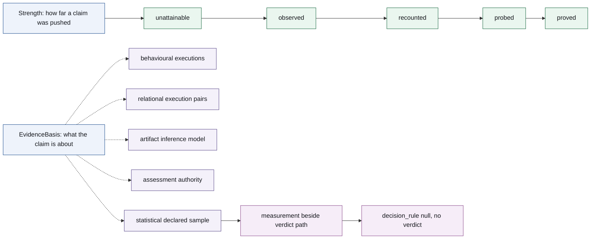

# 8 — Evidence

Chapter 8 gives the evidence structure carried by a conformance result. It separates the
**strength** of a conclusion from the **basis** of the evidence: one is ordered, the other is a
kind. The distinction is a property of the result model, not a new engine or a new verdict.

## 8.1 Strength: the ordered coordinate

**Definition 8.1 (strength chain).** `verdict.Strength` is the strict total order

`unattainable < observed < recounted < probed < proved`

$$
\mathsf{unattainable} < \mathsf{observed} < \mathsf{recounted} <
\mathsf{probed} < \mathsf{proved}.
$$

The names are methods of obtaining evidence. `unattainable` records that the capability gate
stopped evaluation; `observed` records a conclusion from the supplied trace; `recounted` records a
delection probe over reasons the system itself recounted; `probed` records bounded replay through
`decide()` (or enumeration over an artefact); and `proved` records solver reasoning over the
valuations admitted by declared constraints. `strength=None` is not a sixth element: it says that
no engine evaluated the duty.

This order is not a confidence score and does not compare duties. It ranks how far one claim was
pushed, not how useful or representative the underlying object is. Combining results uses the
weakest-link direction, and an empty combination is `inconclusive`, not vacuously `satisfied`.

## 8.2 Basis: the unordered coordinate

**Definition 8.2 (evidence basis).** `verdict.EvidenceBasis` classifies what a duty's evidence is
about:

| Basis | Object of the claim |
|---|---|
| `behavioural` | the system's executions, one at a time (a trace property) |
| `relational` | a pair of executions (a 2-safety property) |
| `artifact` | the inference artefact behind a decision |
| `assessment` | how an open-textured predicate applies, according to a named authority |
| `statistical` | a declared sample, sampling model, estimand and uncertainty procedure |

A basis is a kind and never a rank. Its members have no ordering, and a basis is not comparable with
a `Strength`: the coordinates answer different questions. Evidence about a different object is a
basis; evidence about the same object reached less deeply is a strength rung. Thus `recounted` is a
rung on the `artifact` row, not a fifth basis.

The two coordinates are deliberately drawn as separate paths: the strength chain is ordered, while
basis branches classify the object of a claim. The statistical branch stops at a measurement and
never enters the verdict chain.

## 8.3 Admissibility

Let `EvidenceBasis` and `Strength` be the two sets named above. The admissibility relation is

$$
\sqsubseteq \thickspace\subseteq\thickspace \mathrm{EvidenceBasis} \times \mathrm{Strength},
$$

and `verdict.BASIS_RUNGS` is its executable registry. A pair belongs to the relation exactly when its basis admits its strength:

| Basis | Admits |
|---|---|
| `behavioural` | `unattainable`, `observed`, `probed`, `proved` |
| `relational` | `unattainable`, `probed`, `proved` |
| `artifact` | `unattainable`, `recounted`, `probed` |
| `assessment` | `unattainable` |
| `statistical` | `unattainable` |

`unattainable` is present in every row because capability analysis precedes the basis-specific
engine. The relational row has no `observed` rung because one record is not a pair. The artefact
row has no `observed` rung because a trace does not contain the inference artefact, and no `proved`
rung because its enumeration is exact only for the one artefact and interpretation it examined.
The assessment row has no engine rung: its open-textured predicate is measured or named, not settled
by this system.

**Proposition 8.1 (result invariant).** A `RequirementResult` may carry a basis and strength pair only when that pair belongs to $\sqsubseteq$. `RequirementResult.__post_init__` enforces this relation after parsing the
`Verdict`, `Strength`, and `EvidenceBasis` values. The basis is derived from the requirement by
`report.evidence_basis`, stamped by `evaluate_requirement`, and is never a pack or adapter claim. [test-backed implementation invariant: test_the_basis_admits_exactly_the_rungs_the_ladder_can_reach]

Consequently, no engine ladder can publish a rung its basis refuses, and no rendering can turn a
basis into an extra rung. The relation changes neither verdicts nor strengths; it records the
already-produced evidence without widening what any duty can claim.

## 8.4 Statistical measurement

The `statistical` basis is a measurement basis, not a fifth strength rung.  Its first-wave
admissibility row contains only `unattainable`: a computed sample measurement carries
`verdict=inconclusive`, `outcome=not_evaluated`, and `strength=None`.  The measurement records the
fixed duty-named groups, raw per-record counts and point estimates, simultaneous
Clopper--Pearson binomial intervals with Bonferroni allocation, the ratio enclosure, the
caller-supplied sampling plan, and the authority provenance.  A missing plan yields descriptive
rates only; a valid plan without a named authority remains not evaluated.  `decision_rule` is
`null` in this wave, so no ratio or interval becomes a satisfied or violated verdict.

The interval's repeated-sampling coverage is conditional on the declared plan.  Records supplied
to a run are never called representative, and the result carries the standing limit that this
association does not detect proxies, causal discrimination, intersectional effects, disparate
treatment, applicant discouragement, or criteria requiring ground truth.  The 29 CFR 1607.4(D)
source record is scoped to employment selection; no four-fifths threshold is transplanted into
ECOA or GDPR duties.

## 8.5 Graded assessment

The open-textured constructs are evidence about assessment, not another strength rung. The
residuated algebra and state denotation are Definitions 3.2–3.7; this chapter records the evidence
boundary: a `manyvalued.Grading` is supplied beside the pack, carries its authority, scale, and
method, and is never taken from the audited system. A non-empty trace degree is the infimum defined
in Definition 3.12. An empty trace or an unscored atom is not evaluated, not a degree of one or zero.

A degree is a measurement and does not become `satisfied` or `violated` without a legal threshold.
It carries no `Strength`; `assessment` admits only the capability-gate state in `BASIS_RUNGS`. A
graded atom under comparison, arithmetic, or a temporal operator is refused, and a two-valued duty
cannot acquire a degree. No shipped requirement uses either open-texture construct.

The executable warrants for these statements are collected in [`claim-map.md`](claim-map.md),
including the ordering, non-comparability, admissibility, derivation, and no-verdict-change tests.
